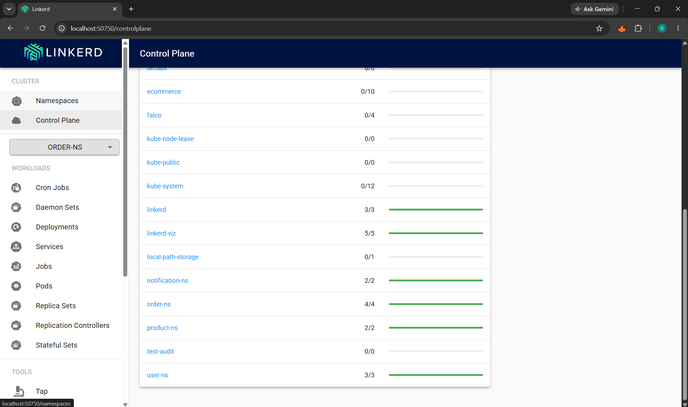
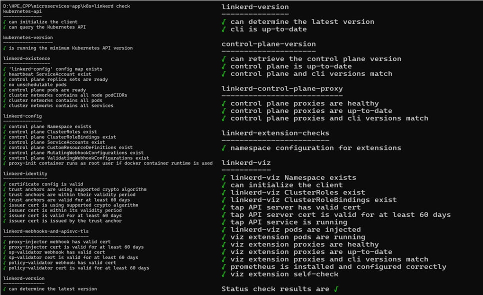
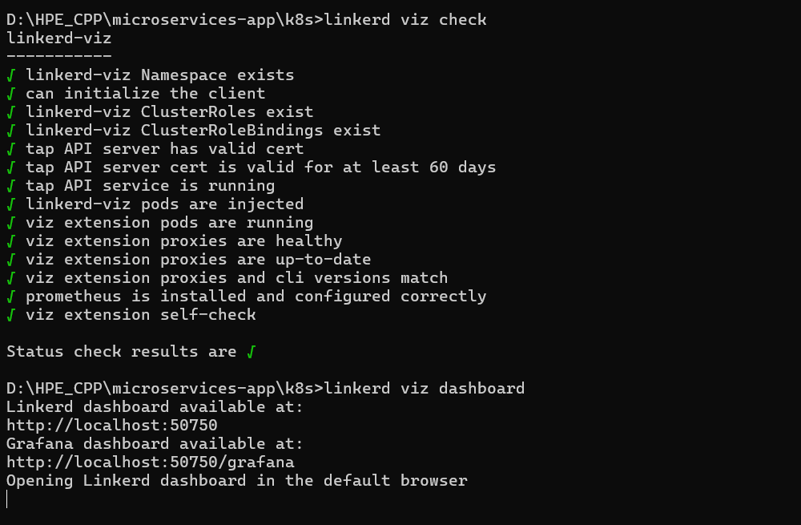
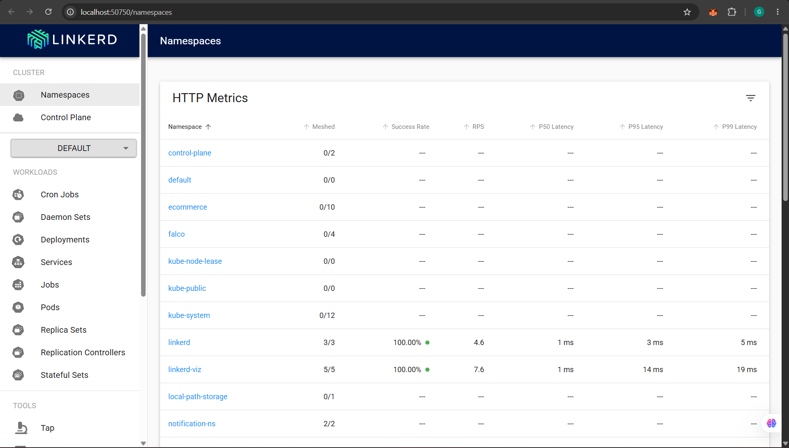

## Screenshots and Evidence

### 1. Linkerd Sidecar Injection

**Location:**

```bash
kubectl get pods -A
```

**Purpose:**
Shows that business microservice pods now have **2/2 containers running**, indicating successful Linkerd sidecar proxy injection.

**Screenshot:**

```text
screenshots/linkerd-sidecar-injection.png
```



---

### 2. Linkerd Health Check

**Location:**

```bash
linkerd check
```

**Purpose:**
Verifies that all Linkerd control plane components are installed and functioning correctly.

**Screenshot:**

```text
screenshots/linkerd-check.png
```



---

### 3. Linkerd Viz Extension Check

**Location:**

```bash
linkerd viz check
```

**Purpose:**
Confirms that the Linkerd Viz extension (Prometheus, Tap, Web UI, Metrics API) is properly installed and operational.

**Screenshot:**

```text
screenshots/linkerd-viz-check.png
```



---

### 4. Linkerd Observability Dashboard

**Location:**

```bash
linkerd viz dashboard
```

Then open the dashboard URL generated by Linkerd in the browser.

**Purpose:**
Displays service mesh observability including request rates, latency metrics, success rates, and traffic flow.

**Screenshot:**

```text
screenshots/linkerd-observability.png
```


---

### 5. Service Mesh Dashboard Validation

**Location:**

```bash
linkerd viz dashboard
```

Navigate to:

```text
Linkerd Web UI → Namespaces → user-ns / product-ns / order-ns / notification-ns
```

**Purpose:**
Validates that the business services are successfully meshed and managed by Linkerd.

**Screenshot:**

```text
screenshots/linkerd-dashboard.png
```



---

### Screenshot Directory Structure

Store all screenshots inside:

```text
service-mesh/
└── screenshots/
    ├── linkerd-sidecar-injection.png
    ├── linkerd-check.png
    ├── linkerd-viz-check.png
    ├── linkerd-observability.png
    └── linkerd-dashboard.png
```
